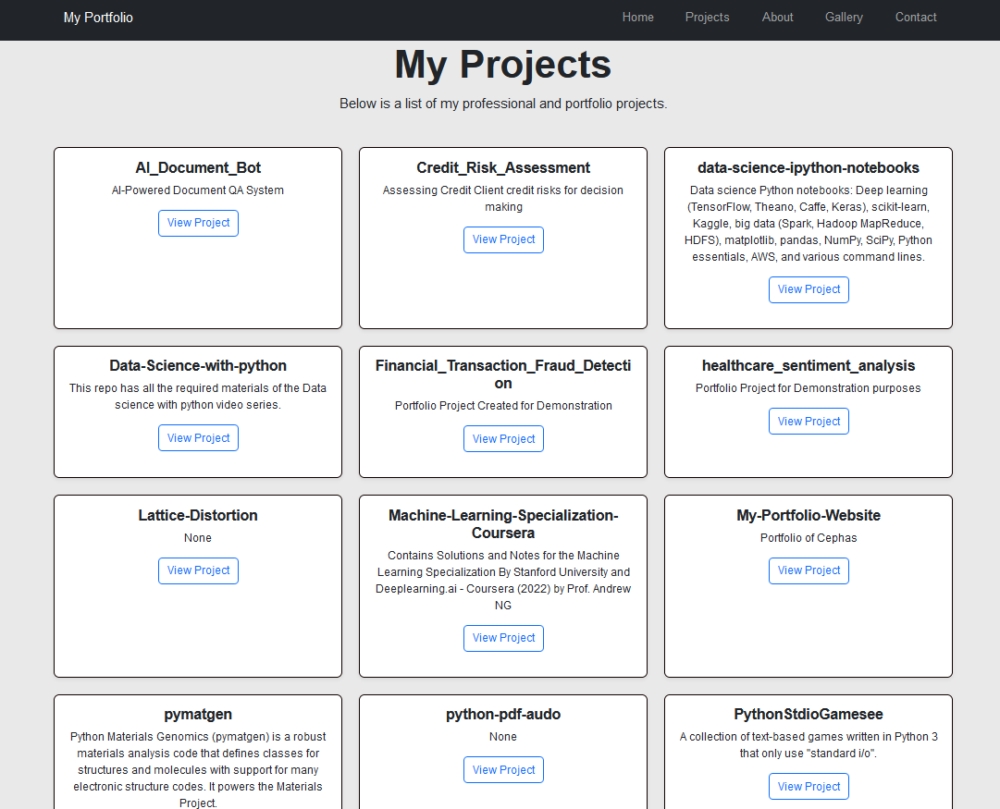

---

# **Cephas Acquah Forson - Portfolio Website**

This is a personal portfolio website showcasing my professional work, skills, projects, and experience in **Data Science, GIS, Machine Learning, and AI**. It serves as an interactive hub to share my accomplishments, resumes, and project details.

---

## **Table of Contents**

- [Features](#features)
- [Technologies Used](#technologies-used)
- [Project Structure](#project-structure)
- [Setup and Installation](#setup-and-installation)
- [Deployment](#deployment)
- [Gallery and Screenshots](#gallery-and-screenshots)
- [Contributing](#contributing)
- [Contact](#contact)

---

## **Features**

✅ **Modern UI/UX**  
- Fully responsive design using Bootstrap 5.  
- Lightbox-enabled image gallery.  
- Hero banner for visual impact.

✅ **Dynamic Pages**  
- Work Experience, Education, Skills, Certifications, and Recommendations displayed dynamically.  
- Project cards link to GitHub repositories with optional project images.

✅ **Contact Form**  
- Secure contact form with CSRF protection and input validation using Flask-WTF.  
- Integrated email functionality powered by Flask-Mail.

✅ **SEO Optimization**  
- Meta tags and Open Graph tags for better search engine visibility.

✅ **Resume Section**  
- Dynamically lists all resumes uploaded in the `files/` folder for download.

✅ **Gallery**  
- Displays personal and professional images in a grid with lazy loading for performance.

---

## **Technologies Used**

### **Frontend**  
- **HTML5/CSS3**: Structure and styling.  
- **Bootstrap 5**: Responsive design and components.  
- **Lightbox2**: For image gallery enhancement.

### **Backend**  
- **Flask**: Python web framework.  
- **Flask-WTF**: Form handling with CSRF protection.  
- **Flask-Mail**: Contact form email integration.  
- **Gunicorn**: Production server for deployment.

### **Hosting**  
- **Heroku**: Hosting platform for deploying the website.

---

## **Project Structure**

```
portfolio_website/
│-- static/               # Static files (CSS, JS, images, files)
│   ├── css/              # Custom stylesheets
│   ├── images/           # Banner, gallery images
│   ├── files/            # Resume files
│-- templates/            # HTML templates
│   ├── base.html         # Layout template
│   ├── index.html        # Home page
│   ├── about.html        # About Me page
│   ├── projects.html     # Projects page
│   ├── gallery.html      # Image gallery
│   └── contact.html      # Contact form
│-- app.py                # Main Flask application
│-- Procfile              # Heroku process file
│-- requirements.txt      # Project dependencies
│-- runtime.txt           # Python version
```

---

## **Setup and Installation**

Follow these steps to set up and run the project locally:

### **1. Clone the Repository**

```bash
git clone https://github.com/yourusername/portfolio-website.git
cd portfolio-website
```

### **2. Set Up a Virtual Environment**

```bash
python -m venv venv
source venv/bin/activate      # On Windows: venv\Scripts\activate
```

### **3. Install Dependencies**

```bash
pip install -r requirements.txt
```

### **4. Set Up Environment Variables**

Create a `.env` file and add your mail server credentials:

```plaintext
MAIL_SERVER=smtp.gmail.com
MAIL_PORT=587
MAIL_USERNAME=your_email@gmail.com
MAIL_PASSWORD=your_password
MAIL_USE_TLS=True
SECRET_KEY=your_secret_key
```

### **5. Run the Application**

```bash
python app.py
```

Visit `http://127.0.0.1:5000` in your browser.

---

## **Deployment**

This project is deployed using **Heroku**.

1. Install Heroku CLI and initialize a Git repository:

   ```bash
   heroku login
   git init
   heroku create
   ```

2. Add the Heroku remote and push to production:

   ```bash
   git add .
   git commit -m "Deploy portfolio"
   git push heroku master
   ```

3. Visit the deployed app at the provided Heroku URL.

---

## **Gallery and Screenshots**

### **Home Page**


### **Projects Page**


### **Image Gallery**


---

## **Contributing**

Contributions are welcome! To contribute:

1. Fork this repository.
2. Create a feature branch: `git checkout -b new-feature`.
3. Commit your changes: `git commit -m "Add new feature"`.
4. Push to the branch: `git push origin new-feature`.
5. Submit a pull request.

---

## **Contact**

**Cephas Acquah Forson**  
- **LinkedIn**: [linkedin.com/in/cephasaforson](https://www.linkedin.com/in/cephasaforson/)  
- **GitHub**: [github.com/cephas2bn](https://github.com/cephas2bn)  
- **Email**: cephasfn@gmail.com  

---

© 2024 Cephas Acquah Forson. All Rights Reserved.  

--- 
